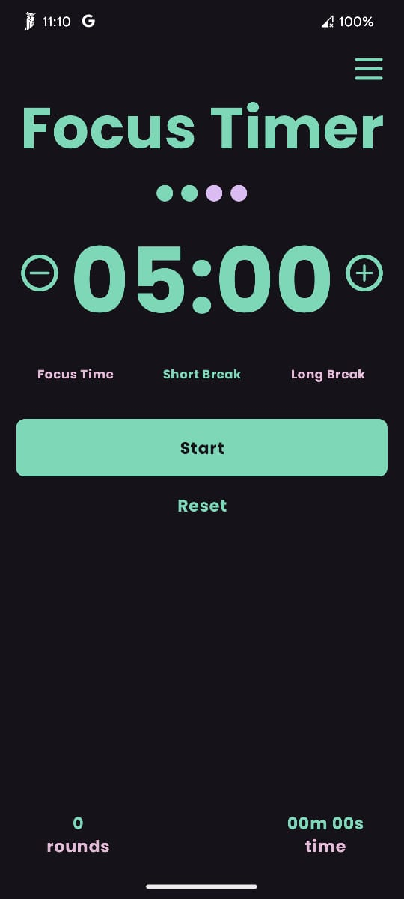

# Focus Timer ⏱️

A minimalist Pomodoro timer app built with modern Android technologies.



## 🎯 Features

- Three timer modes:
  - Focus Time (25 minutes)
  - Short Break (5 minutes)
  - Long Break (15 minutes)
- Customizable timer durations
- Start/Reset functionality
- Tracks accumulated time and completed rounds
- Persistent data storage using Room

## 🛠️ Tech Stack

- **Kotlin**
- **Jetpack Compose**
- **Material 3**
- **Room Database**
- **ViewModel**
- **Coroutines**
- **Flow**

## ⚙️ Requirements

- Android Studio Koala or higher
- Kotlin 2.0+
- minSdk: 24
- compileSdk: 35

## 🚀 Installation

1. Clone repository
```bash
git clone https://github.com/BEKH4MDEV/FocusTimer.git
```

2. Open in Android Studio
3. Sync with Gradle
4. Run the app
